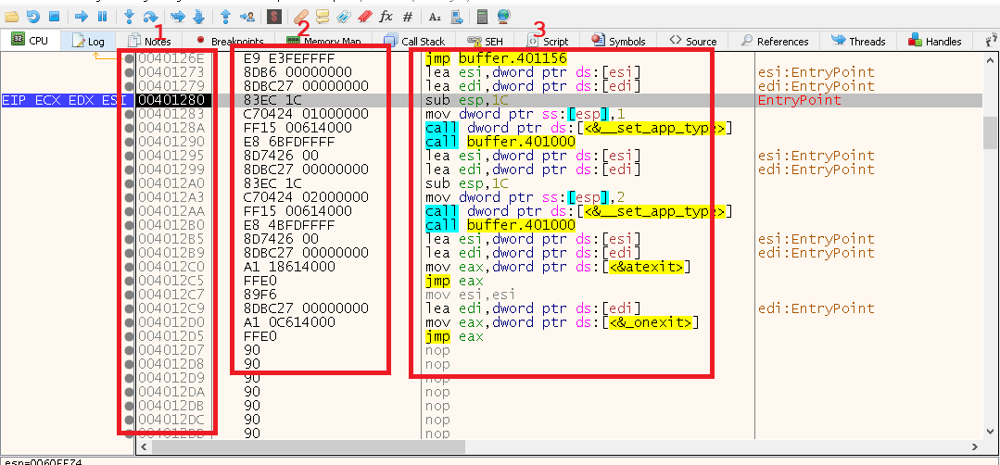
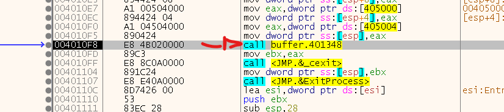

# BufferOverflow :notebook:

<p align="center">
  
</p>

## Introduction

In a simple way, I will show how a BufferOverFlow is created in a program written in the C language. For this laboratory, we will use codeblocks to create a simple code in C with a secret function. To view the buffer in memory, we will also use an assembly debugger, called x64dbg.

Softwares;
* [CodeBlocks for C](https://www.codeblocks.org)

* [Debugger x64dbg](https://x64dbg.com)

## Basics about x64dbg

In this step, let's quickly talk about windows and some information about x64dbg.

Explaining each window.

1 - The memory address is given in hexadecimal.<br>
2 - The value that is in the memory address of window 1 is informed.<br>
3 - In the form of mnemonics, instructions for each address are provided.
<p align="center">
  
</p>
4 - These are the registers (
32bit). Registers are used to store temporary data and memory addresses during program execution.<br>
5 - This is the Flags field. These are special bits in a register that represent the result of an arithmetic or logical operation. They are used to indicate conditions such as equality, greater than, less than, among others, and are often used in conditional branch instructions to control program flow.<br><br>

<p align="center">
  
</p>

6 - The name of this window is **Stack**. A special memory region used to store temporary data, return addresses, and function call contexts. The **Stack** is a LIFO (Last In, First Out) data structure.
<p align="center">
  
</p>

These are the 6 basic windows that we will use to visualize the program's BufferOverFlow process.

I think we're ready to go! :)

## Buffer? OverFlow?

The BufferOverflow is a security vulnerability that occurs when a program attempts to store more data in a buffer than it was designed to hold. This could allow an attacker to execute malicious code or corrupt important data on the affected system.

Below we can see an example of how this works. In this case, a variable with a size of 8 bytes is declared, however, there is no limitation on sending data to the program, causing BufferOverFlow when sending 14 bytes.

<p align="center">
  
</p>

In some cases, we can perform RCE by exploiting a BufferOverFlow, changing and overwriting the next EIP memory address (Let's talk about this)

## How are we going to do it?

First, let's create a basic code in C in codeblocks as shown in the example below.

```
#include <stdio.h>
#include <string.h>

void secret() {
    printf("Secret Function\n");
}

int main(int argc, char **argv){
    char test[12];
    gets(test);
    printf("You send: %s\n", test);
    return(0);
}
```
We are creating 2 functions, the main one which only shows the text we type. And we have another function called secret. As we can see, the main function does not call the secret function, so let's try to use the BufferOverFlow vulnerability to try to call the secret function by overwriting memory addresses.

<p align="center">
  
</p>

To make this laboratory simpler, we are using the GCC compiler and 32-bit Codeblocks, however, the exploration logic for 64-bits is the same.

## Let's explore!

Assembly language is complex and has a lot of theory to be explained, so I'm going directly to the exploration points explaining it in a basic way.

1 - Let's jump directly to the function of our program, clicking on the RUN button (Arrow >) until we find the **EntryPoint** of Buffer.exe (Name of my C). 

Right after the **EntryPoint**, we have some basic executions of the program, it is not our main function yet.

<p align="center">
  
</p>

2 - Let's go to our MAIN function. Using the **F8** button, we go to the function line **[buffer.401000]** (This name may change to different compilers). We enter this function with **F7**.

<p align="center">
  
</p>

3 - We will be sent to start a new role, however, it is not yet the main one.

<p align="center">
  
</p>

Navigating through the function using **F8**, we find a new function **[buffer.401348]**. This is our main function of the C program. We enter it **(F7)**
<p align="center">
  
</p>

This is the beginning of our MAIN function.
<p align="center">
  
</p>

4 - 

### Working ....